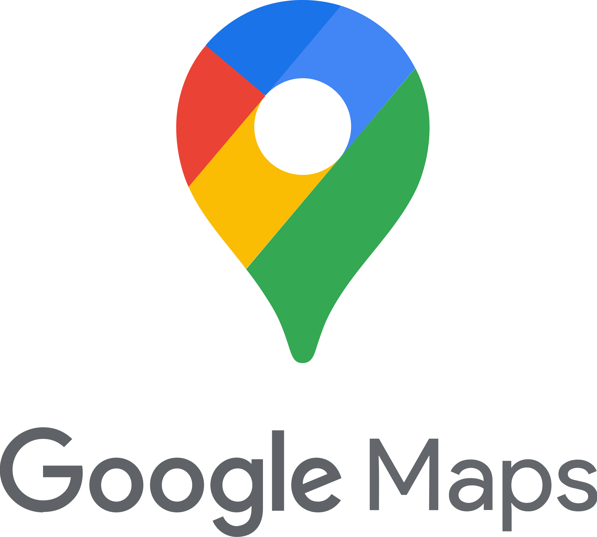

# INFORME DEL TRABAJO FINAL

### UNIVERSIDAD PERUANA DE CIENCIAS APLICADAS

### INGENIERÍA DE SISTEMAS DE INFORMACIÓN Y SOFTWARE

### CICLO 2024-02

<h4>
    Nombre del curso: Desarrollo de Aplicaciones Open-Source 
    Sección: 4348 
    Nombre del Profesor: Hugo Allan Mori Paiva 
    Nombre del StartUp: SabroSaic  
    Nombre del Producto: PlatoX
</h4>

### Relación de Integrantes:

<table style="text-align: center;">
    <tr>
        <th colspan="2">Nombre</th>
        <th colspan="10">Código</th>
    </tr>
    <tr>
        <td colspan="2">Chamorro Acero, Salvador Edward</td>
        <td colspan="10">U201914367</td>
    </tr>
    <tr>
        <td colspan="2">Mendoza Solis, Javier Kenyi</td>
        <td colspan="10">U201824550</td>
    </tr>
    <tr>
        <td colspan="2">Calixto Iriarte, David Alejandro</td>
        <td colspan="10">U20201B441</td>
    </tr>
    <tr>
        <td colspan="2">Carhuancote Dominguez, Gonzalo Alonso</td>
        <td colspan="10">U202210720</td>
    </tr>
    <tr>
        <td colspan="2">Calle Huayanca, Adrian Alonso</td>
        <td colspan="10">U202011657</td>
    </tr>
</table>

## Historial de Versiones

<table>
    <tr>
        <th colspan="3">Version</th>
        <th colspan="3">Fecha</th>
        <th colspan="10">Autores</th>
        <th colspan="5">Descripción de Modificaciones</th>
    <tr>
        <td colspan="3">TB1</td>
        <td colspan="3">24/04/2025</td>
        <td colspan="10">
            Chamorro Acero, Salvador Edward
            Mendoza Solis, Javier Kenyi
            Calixto Iriarte, David Alejandro
            Carhuancote Dominguez, Gonzalo Alonso
            Calle Huayanca, Adrian Alonso
        </td>
        <td colspan="5">
            Creación de Capítulos 1 - 5 
            Creación de la primera version de la Landing Page 
        </td>
    </tr>
    <tr>
        <td colspan="3">TP</td>
        <td colspan="3">12/05/2025</td>
        <td colspan="10">
            Chamorro Acero, Salvador Edward
            Mendoza Solis, Javier Kenyi
            Calixto Iriarte, David Alejandro
            Carhuancote Dominguez, Gonzalo Alonso
            Calle Huayanca, Adrian Alonso
        </td>
        <td colspan="5">
            Correción de Errores 
            Correción y mejoramiento de la Landing Page 
            Creación de la primera Version del FrontEnd 
            Despliegue de Landing Page y FrontEnd, conectados correctamente 
        </td>
    </tr>
    <tr>
        <td colspan="3">TB2</td>
        <td colspan="3"></td>
        <td colspan="10"></td>
        <td colspan="5"></td>
    </tr>
</table>

## Project Report Collaboration Insights

A continuación, se detalla el proceso de elaboración del informe para cada entrega, junto con capturas de pantalla que
muestran los análisis de colaboración y commits en GitHub para el repositorio del informe:

**URL del Repositorio del Informe:** https://github.com/Open-Source-Grupo3/Informe

**Entrega N°1: TB1**

**Entrega N°2: TP1**

**Entrega N°3: TB2**

# Índice

- [Capítulo I: Introducción]()
    - [1.1. StartUp Profile](#11-startup-profile)
        - [1.1.1. Descripción de la StartUp](#111-descripción-de-la-startup)
        - [1.1.2. Perfiles de Integrantes del equipo](#112-perfiles-de-integrantes-del-equipo)
    - [1.2. Solution Profile](#12-solution-profile)
        - [1.2.1. Antecedentes y Problemática](#121-antecedentes-y-problemática)
        - [1.2.2. Lean UX Process](#122-lean-ux-process)
            - [1.2.2.1. Lean UX Problem Statements](#1221-lean-ux-problem-statements)
            - [1.2.2.2. Lean UX Assumptions](#1222-lean-ux-assumptions)
            - [1.2.2.3. Lean UX Hypothesis Statements](#1223-lean-ux-hypothesis-statements)
            - [1.2.2.4. Lean UX Canvas](#1224-lean-ux-canvas)
    - [1.3. Segmentos objetivo](#13-segmentos-objetivo)
- [Capítulo II: Requirements Elicitation & Analysis]()
    - [2.1. Competidores](#21-competidores)
        - [2.1.1 Análisis competitivo](#211-análisis-competitivo)
        - [2.1.2. Estrategias y tácticas frente a competidores](#212-estrategias-y-tácticas-frente-a-competidores)
    - [2.2. Entrevistas](#22-entrevistas)
        - [2.2.1 Diseño de entrevistas](#221-diseño-de-entrevistas)
        - [2.2.2. Registro de entrevistas](#222-registro-de-entrevistas)
        - [2.2.3. Análisis de entrevistas](#223-análisis-de-entrevistas)
    - [2.3. Needfinding](#23-needfinding)
        - [2.3.1. User Persona](#231-user-personas)
        - [2.3.2. User Task Matrix](#232-user-task-matrix)
        - [2.3.3. User Journey Mapping](#233-user-journey-mapping)
        - [2.3.4. Empathy Mapping](#234-empathy-mapping)
        - [2.3.5. As-is Scenario Mapping](#235-as-is-scenario-mapping)
    - [2.4. Ubiquitous Language](#24-ubiquitous-language)
- [Capítulo III: Requirements Specification]()
    - [3.1. To-Be Scenario Mapping](#31-to-be-scenario-mapping)
    - [3.2. User Stories](#32-user-stories)
    - [3.3. Impact Mapping](#33-impact-mapping)
    - [3.4. Product Backlog](#34-product-backlog)
- [Capítulo IV: Product Design]()
    - [4.1. Style Guidelines](#41-style-guidelines)
        - [4.1.1. General Style Guidelines](#411-general-style-guidelines)
        - [4.1.2. Web Style Guidelines](#412-web-style-guidelines)
    - [4.2. Information Architecture](#42-information-architecture)
        - [4.2.1. Organization Systems](#421-organization-systems)
        - [4.2.2. Labeling Systems](#422-labeling-systems)
        - [4.2.3. SEO Tags and Meta Tags](#423-seo-tags-and-meta-tags)
        - [4.2.4. Searching Systems](#424-searching-systems)
        - [4.2.5. Navigation Systems](#425-navigation-systems)
    - [4.3. Landing Page UI Design](#43-landing-page-ui-design)
        - [4.3.1. Landing Page Wireframe](#431-landing-page-wireframe)
        - [4.3.2. Landing Page Mock-up](#432-landing-page-mock-up)
    - [4.4. Web Applications UX/UI Design](#44-web-applications-uxui-design)
        - [4.4.1. Web Applications Wireframes](#441-web-applications-wireframes)
        - [4.4.2. Web Applications Wireflow Diagrams](#442-web-applications-wireflow-diagrams)
        - [4.4.3. Web Applications Mock-ups](#443-web-applications-mock-ups)
        - [4.4.4. Web Applications User Flow Diagrams](#444-web-applications-user-flow-diagrams)
    - [4.5. Web Applications Prototyping](#45-web-applications-prototyping)
    - [4.6. Domain-Driven Software Architecture](#46-domain-driven-software-architecture)
        - [4.6.1. Software Architecture Context Diagram](#461-software-architecture-context-diagram)
        - [4.6.2. Software Architecture Container Diagrams](#462-software-architecture-container-diagrams)
        - [4.6.3. Software Architecture Components Diagrams](#463-software-architecture-components-diagrams)
    - [4.7. Software Object-Oriented Design](#47-software-object-oriented-design)
        - [4.7.1. Class Diagrams](#471-class-diagrams)
        - [4.7.2. Class Dictionary](#472-class-dictionary)
    - [4.8. Database Design](#48-database-design)
        - [4.8.1. Database Diagram](#481-database-diagram)
- [Capítulo V: Product Implementation, Validation & Deployment]()
    - [5.1. Software Configuration Management](#51-software-configuration-management)
        - [5.1.1. Software Development Environment Configuration](#511-software-development-environment-configuration)
        - [5.1.2. Source Code Management](#512-source-code-management)
        - [5.1.3. Source Code Style Guide & Conventions](#513-source-code-style-guide--conventions)
        - [5.1.4. Software Deployment Configuration](#514-software-deployment-configuration)
    - [5.2. Landing Page, Services & Applications Implementation](#52-landing-page-services--applications-implementation)
        - [5.2.1. Sprint 1](#521-sprint-1)
            - [5.2.1.1. Sprint Planning 1](#5211-sprint-planning-1)
            - [5.2.1.2. Sprint Backlog 1](#5212-sprint-backlog-1)
            - [5.2.1.3. Development Evidence for Sprint Review](#5213-development-evidence-for-sprint-review)
            - [5.2.1.4. Testing Suite Evidence for Sprint Review](#5214-testing-suite-evidence-for-sprint-review)
            - [5.2.1.5. Execution Evidence for Sprint Review](#5215-execution-evidence-for-sprint-review)
            - [5.2.1.6. Services Documentation Evidence for Sprint Review](#5216-services-documentation-evidence-for-sprint-review)
            - [5.2.1.7. Software Deployment Evidence for Sprint Review](#5217-software-deployment-evidence-for-sprint-review)
            - [5.2.1.8. Team Collaboration Insights during Sprint](#5218-team-collaboration-insights-during-sprint)
- [Conclusiones](#conclusiones)
  - [Conclusiones y recomendaciones](#conclusiones-y-recomendaciones) 
- [Bibliografía](#bibliografía)
- [Anexos](#anexos)

# Student Outcome

<table>
  <tr>
     <th colspan="2">Criterio Específico</th>
     <th colspan="10">Acciones Realizadas</th>
     <th colspan="2">Conclusiones</th>
  </tr>
  <tr>
     <td colspan="2">Comunica oralmente con efectividad a diferentes rangos de audiencia.</td>
     <td colspan="10">
        <b>Gonzalo Alonso Carhuancote Dominguez</b>
        
TB1: Elaboración de la Landing Page Inicial y desarrollo del Capítulo 3, además de una entrevista para trabajo

        
TP: Implementación de Mejoras y finalización de la Landing Page y del capítulo 3. Elaboración del Language-Switcher, Home, profile, footer y login component del FrontEnd

        
TB2:

        
TF:

        <b>Javier Kenyi Mendoza Solis</b>
        
TB1: Elaboracion de la primera version del Product Design, ademas de una entrevista para trabajo

        
TP: Elaboracion de la primera version del Style Guidelines, Labeling Systems y Searching Systems

        
TB2:

        
TF:

         <b>--</b>
        
TB1:

        
TP:

        
TB2:

        
TF:

         <b>--</b>
        
TB1:

        
TP:

        
TB2:

        
TF:

         <b>--</b>
        
TB1:

        
TP:

        
TB2:

        
TF:

     </td>
     <td colspan="2">
        
TB1: En esta etapa del proyecto, hemos definido y documentado las historias de usuario que guiarán la creación de nuestra aplicación web. Identificamos las principales funcionalidades necesarias para cocineros y clientes, como publicar menús, hacer pedidos o gestionar perfiles. Aplicamos buenas prácticas con formato Gherkin y estructura clara, asegurando trazabilidad y validación de requisitos. Este trabajo nos permitió comprender mejor las necesidades del usuario y cómo traducirlas en funciones clave. Con ello, sentamos una base sólida para el diseño y desarrollo de la app PlatoX.

        
TP:

        
TB2:

        
TF:

     </td>
  </tr>
  <tr>
     <td colspan="2">Comunica por escrito con efectividad a diferentes rangos de audiencia</td>
     <td colspan="10">
        <b>Gonzalo Alonso Carhuancote Dominguez</b> 
        
TB1: Durante la primera entrega, pude realizar una entrevista partir de las historias de usuario, además de crear la Landing Page a partir de las necesidades de los usuarios

        
TP:

        
TB2:

        
TF:

        <b>Javier Kenyi Mendoza Solis</b>
        
TB1:

        
TP:

        
TB2:

        
TF:

        <b>--</b>
        
TB1:

        
TP:

        
TB2:

        
TF:

        <b>--</b>
        
TB1:

        
TP:

        
TB2:

        
TF:

        <b>--</b>
        
TB1:

        
TP:

        
TB2:

        
TF:

     </td>
     <td colspan="2">
        
TB1:

        
TP:

        
TB2:

        
TF:

     </td>
  </tr>
</table>

# Startup Profile

# Capítulo I: Introduction

## 1.1. Startup Profile

### 1.1.1. Descripción de la Startup

Nuestra startup estará enfocada en una plataforma digital que conecta restaurantes locales con los consumidores
interesados en experiencias gastronómicas diferentes y cercanas. Buscamos potenciar la visibilidad de los pequeños
negocios de comida, permitiendo que los usuarios descubran restaurantes, puestos de comida, accediendo a menús del día,
publicaciones y promociones personalizadas. Nuestra startup funciona como un puente entre oferta y demanda gastronómica
local, enfatizando en la experiencia, la autenticidad y la convivencia.

### 1.1.2. Perfiles de integrantes del equipo

<table>
 <tr>
     <th colspan="3">Foto</th>
     <th colspan="3">Apellido y Nombre</th>
     <th colspan="10">Carrera</td>
     <th colspan="5">Acerca de</td>
     <th colspan="2">Codigo</td>
   <tr>
     <td colspan="3">
      
     </td>
     <td colspan="3">Mendoza Solis Javier Kenyi</td>
     <td colspan="10">Ingenieria de Software</td>
     <td colspan="5">Soy estudiante de Ingeniería de Software con una fuerte vocación por el aprendizaje constante y la formación autodidacta. Me caracterizo por una actitud proactiva y una excelente capacidad para integrarme y contribuir en equipos de trabajo colaborativos</td>
     <th colspan="2">u201824550</td>
   </tr>
   <tr>
     <td colspan="3"></td>
     <td colspan="3"></td>
     <td colspan="10"></td>
     <td colspan="5"></td>
     <td colspan="2"></td>
   </tr>
   <tr>
     <td colspan="3"></td>
     <td colspan="3"></td>
     <td colspan="10"></td>
     <td colspan="5"></td>
     <td colspan="2"></td>
   </tr>
   <tr>
     <td colspan="3"></td>
     <td colspan="3"></td>
     <td colspan="10"></td>
     <td colspan="5"></td>
     <td colspan="2"></td>
   </tr>
   <tr>
     <td colspan="3"></td>
     <td colspan="3"></td>
     <td colspan="10"></td>
     <td colspan="5"></td>
     <td colspan="2"></td>
   </tr>
  <tr>
     <td colspan="3"></td>
     <td colspan="3"></td>
     <td colspan="10"></td>
     <td colspan="5"></td>
     <td colspan="2"></td>
   </tr>
  <tr>
     <td colspan="3"></td>
     <td colspan="3"></td>
     <td colspan="10"></td>
     <td colspan="5"></td>
     <td colspan="2"></td>
   </tr>
   </table>

## 1.2. Solution Profile

PlatoX es una solución digital pensada para revitalizar la gastronomía local, conectando directamente a restaurantes independientes, puestos de comida y cocinas emergentes con consumidores interesados en experiencias culinarias auténticas y cercanas. La plataforma permite a los negocios gastronómicos publicar menús diarios, promociones, horarios y contenido personalizado para atraer clientes, todo desde una interfaz amigable. Por su parte, los usuarios pueden descubrir nuevas propuestas culinarias cerca de su ubicación, filtrar por tipo de comida o precio, y disfrutar de recomendaciones basadas en sus gustos e historial. PlatoX no solo aumenta la visibilidad de los pequeños negocios de comida, sino que también promueve la economía local y la convivencia a través de la comida. A largo plazo, se proyecta como una comunidad digital de referencia para los amantes de la gastronomía urbana auténtica, ofreciendo experiencias únicas y apoyando a quienes hacen de la cocina su pasión y sustento.

### 1.2.1. Antecedentes y problemática

Teniendo en cuenta el análisis competitivo, salió a relevancia que hay una carencia en plataformas enfocadas
específicamente en la visibilidad de restaurantes pequeños y/o cocineros independientes. Plataformas como TripAdvisor o
Google Maps privilegian a grandes establecimientos y zonas turísticas, mientras que Rappi se enfoca en delivery sin
tener en cuenta el performance de la gastronomía local. Además, las entrevistas con usuarios revelaron una necesidad por
descubrir lugares auténticos según intereses personales y su ubicación.

- **Who (¿Quién?)**: Cocineros locales, propietarios de pequeños restaurantes, consumidores urbanos y turistas
  gastronómicos.
- **What (¿Qué?)**: Dificultad para promocionar comidas y descubrir opciones locales en plataformas tradicionales.
- **Where (¿Dónde?)**: Zonas urbanas y suburbanas con alta densidad gastronómica local.
- **When (¿Cuándo?)**: Acentuado tras la pandemia con la digitalización forzada de pequeños negocios.
- **Why (¿Por qué?)**: Las plataformas actuales favorecen grandes marcas y no contemplan lo local y artesanal.
- **How (¿Cómo?)**: Uso intensivo de redes sociales sin resultados claros y sin canales de descubrimiento efectivos.
- **How Much (¿Cuánto?)**: Más del 60% de locales pequeños no están representados digitalmente con efectividad.

### 1.2.2. Lean UX Process

Para el desarrollo de PlatoX, aplicaremos el enfoque Lean UX con el objetivo de construir una solución centrada en las necesidades reales de los usuarios, validando continuamente nuestras ideas y minimizando el riesgo de desarrollar funcionalidades innecesarias. Esta metodología nos permitirá trabajar de forma ágil y colaborativa, enfocándonos en el diseño de una experiencia significativa para consumidores y restaurantes locales. Utilizaremos la plantilla de Business Opportunity Statements (Gothelf, 2022) como herramienta clave para identificar oportunidades concretas, alinear al equipo en torno a los problemas reales detectados, y generar hipótesis que puedan ser rápidamente testeadas. A través del pensamiento de diseño y ciclos iterativos de ideación, prototipado y validación, buscaremos entender a fondo cómo los usuarios descubren, eligen y valoran la gastronomía local.

#### 1.2.2.1. Lean UX Problem Statements

- **Domain**: Mercado gastronómico digital centrado en cocineros y restaurantes locales.
- **Customer Segments**: Cocineros independientes, pequeños restaurantes, consumidores urbanos.
- **Pain Points**: Falta de visibilidad, baja diferenciación, barreras para descubrir locales auténticos.
- **Gap**: Desconexión entre oferta gastronómica local y usuarios.
- **Visión / Strategy**: Plataforma accesible que conecte cocineros locales con consumidores mediante tecnología.
- **Initial Segment**: Cocineros urbanos con baja digitalización y consumidores de 25-45 años interesados en lo local.
- Los cocineros locales no tienen una plataforma accesible y efectiva para visibilizar sus comidas del día o promociones
  especiales.
- Los consumidores tienen dificultades para descubrir restaurantes locales auténticos adaptados a sus gustos o cercanía.

#### 1.2.2.2. Lean UX Assumptions

- Los cocineros desean publicar su menú diario fácilmente.
- Los consumidores están abiertos a probar comida local visible digitalmente.
- La personalización de la experiencia aumentará el uso.
- Disposición a pagar por visibilidad premium.
- Confianza en recomendaciones comunitarias.

#### 1.2.2.3. Lean UX Hypothesis Statements

- **Hipótesis 1**: Publicaciones diarias aumentan visibilidad y visitas.
- **Hipótesis 2**: Rutas temáticas mejoran descubrimiento e interacción.
- **Hipótesis 3**: Notificaciones y seguimiento generan fidelización.
- **Hipótesis 4**: Perfiles premium motivan pago por exposición.

#### 1.2.2.4. Lean UX Canvas

- **Usuarios**: Cocineros, pequeños restaurantes, consumidores y turistas gastronómicos.
- **Necesidades**: Visibilidad digital, descubrimiento personalizado.
- **Problemas**: Invisibilidad de pequeños locales gastronómicos.
- **Solución**: App con menús, publicaciones, filtros y seguimiento.
- **Beneficio**: Monetización vía premium y publicidad.
- **Canales**: App móvil y presencia web.
- **Métricas clave**: Publicaciones, conversión, retención.
- **Ventaja competitiva**: Foco en lo local, curaduría personalizada, experiencias nuevas.

## 1.3. Segmentos objetivo

- **Cocineros independientes y restaurantes locales**: Aquellos que no cuentan con presencia digital o quieren ampliar
  su alcance sin depender de grandes plataformas.
- **Consumidores locales**: Personas interesadas en experiencias gastronómicas auténticas, de cercanía, que valoran lo
  artesanal y personalizado.

# Capítulo II: Requirements Elicitation & Analysis

## 2.1. Competidores

Hemos identificado tres principales competidores que ofrecen servicios similares a lo que se enfoca nuestro proyecto:

1. **TripAdvisor**: Plataforma global especializada en turismo y experiencias de viaje. Permite a los usuarios buscar y
   comparar hoteles, actividades y restaurantes mediante reseñas, fotos y puntuaciones de otros viajeros. Ofrece
   rankings de restaurantes según ubicación, tipo de comida y popularidad.

2. **Rappi**: Aplicación de delivery muy popular referente a una variedad de productos. Aunque su principal servicio es
   la entrega de comida, productos y servicios, también funciona como un buscador de restaurantes, permitiendo al
   usuario ver menús, calificaciones, horarios y promociones de locales cercanos.

3. **Google Maps**: Herramienta de navegación y mapas con cobertura mundial. Entre sus funciones, incluye un sistema
   robusto para buscar restaurantes cercanos, ver reseñas, calificaciones, fotos, horarios y obtener rutas en tiempo
   real a pie, en auto o en transporte público.

### 2.1.1. Análisis Competitivo

|                        Competidores                        | PlatoX                                                                                                                    | TripAdvisor                                                                                                                   | Rappi                                                                                                    | Google Maps                                                                                                               |
| :--------------------------------------------------------: | ---------------------------------------------------------------------------------------------------------------------------- | --------------------------------------------------------------------------------------------------------------------------- | ------------------------------------------------------------------------------------------------------------------------- | ----------------------------------------------------------------------------------------------------------------------- |
|                          **Logo**                          |                                                                               |                                                                                     |                                                                                          |                                                                                   |
|                         **Perfil**                         |
|                          Overview                          |  Plataforma digital que conecta a restaurantes, puestos de comida y cocinas emergentes con consumidores interesados en experiencias gastronómicas locales, auténticas y accesibles.                    | Plataforma global de turismo con enfoque en experiencias de viaje, incluyendo reseñas y rankings de restaurantes.   | App de delivery que también funciona como buscador de restaurantes con menús, promociones y calificaciones. | Herramienta de mapas y navegación con funciones para descubrir restaurantes cercanos y ver reseñas de usuarios. |
| Ventaja competitiva   ¿Qué valor ofrece a los clientes? | Visibilidad a pequeños negocios de comida, interfaz fácil de usar, recomendaciones personalizadas, conexión directa entre oferta y demanda local, promoción de la economía de barrio y experiencias gastronómicas auténticas.                     | Comunidad activa que deja reseñas y calificaciones, rankings por popularidad y filtros avanzados. | Amplia red de restaurantes afiliados, posibilidad de pedir comida directamente y promociones constantes.                                     | Gran base de datos, integración con navegación, facilidad de uso y reseñas en tiempo real.          |
|                    **Perfil Marketing**                    |
|                      Mercado objetivo                      | Consumidores urbanos que buscan experiencias gastronómicas distintas y restaurantes independientes que quieren aumentar su visibilidad.                                                   | Viajeros y usuarios que buscan experiencias gastronómicas basadas en opiniones globales.                            | Usuarios urbanos que buscan conveniencia y rapidez al pedir comida o buscar restaurantes.                               | Público general que utiliza mapas para movilizarse y descubrir nuevos lugares para comer.                                     |
|                  Estrategias de marketing                  | Promociones destacadas en la app, contenido generado por los usuarios, reseñas verificadas, alianzas con negocios locales, campañas en redes sociales y marketing de influencia en la escena foodie local.                                           | SEO, contenido generado por usuarios, alianzas con portales turísticos y redes sociales.                                       | Marketing digital intensivo, promociones integradas en la app y convenios con restaurantes.                                          | Integración con productos de Google, marketing digital basado en datos y experiencia de usuario personalizada.                               |
|                   **Perfil de Producto**                   |
|                   Productos & Servicios                    | Plataforma web y móvil para descubrir restaurantes, menús diarios, promociones, reseñas, ubicación en tiempo real, favoritos, filtros por tipo de comida y precios, perfil personalizado para restaurantes.                                       | Búsqueda avanzada de restaurantes, reseñas, fotos, rankings, experiencias de usuarios.      | Búsqueda de restaurantes, pedidos a domicilio, promociones y menús en línea.                             | Mapas, búsqueda de restaurantes, reseñas, fotos, rutas y horarios en tiempo real.                     |
|                      Precios & Costos                      | Modelo freemium para restaurantes: acceso gratuito a funciones básicas y suscripción mensual para funcionalidades premium como promociones destacadas, analíticas y soporte preferente. Gratis para los usuarios consumidores.                                                         | Gratuito para usuarios; opción de publicidad paga para restaurantes.                                                | Costo de servicio para el usuario; comisiones a restaurantes.                                   | Gratuito para usuarios; publicidad local y de negocios como modelo de ingreso.                                                 |
|        Canales de distribución   (Web y/o Móvil)        | Plataforma web y app móvil.                                                                                        | Plataforma web y app móvil.                                                                 | Plataforma web y app móvil.                                                              | Plataforma web y app móvil.                                     |

### Análisis SWOT

| **Análisis**       | **TripAdvisor**                                                                 | **Rappi**                                                                  | **Google Maps**                                                                   | **PlatoX**                                                                                 |
|--------------------|----------------------------------------------------------------------------------|-----------------------------------------------------------------------------|-----------------------------------------------------------------------------------|--------------------------------------------------------------------------------------------|
| **Fortalezas**     | Reputación global, muchas reseñas, contenido confiable.                         | Delivery eficiente, promociones, cobertura urbana amplia.                   | Alcance masivo, navegación precisa, múltiples funciones integradas.              | Enfoque en gastronomía local, autenticidad, visibilidad para negocios pequeños.            |
| **Debilidades**    | Poco enfoque en locales pequeños, desactualización en zonas no turísticas.      | No todos los restaurantes están disponibles; enfoque solo en consumo a domicilio. | Falta de curaduría local, saturación de opciones, publicidad.                | Aún en fase inicial, requiere crecimiento de usuarios y restaurantes.                      |
| **Oportunidades**  | Expansión hacia experiencias personalizadas y tours gastronómicos locales.      | Ampliar oferta gastronómica con mejores filtros y descubrimiento local.     | Integración con IA para recomendaciones personalizadas.                          | Crear comunidad digital, implementar rutas temáticas y recomendaciones personalizadas.     |
| **Amenazas**       | Nuevas apps locales más enfocadas en el día a día de los residentes.            | Competencia en apps de delivery y cambios en hábitos de consumo.            | Competidores más especializados en nichos como gastronomía o cultura local.     | Entrada de grandes plataformas en nicho local, baja adopción inicial por parte del usuario. |

### 2.1.2. Estrategias y tácticas frente a competidores

| **MATRIZ FODA y C.A.M.E**                                                                 | **Oportunidades: Aumento del consumo local, búsqueda de experiencias gastronómicas auténticas y creciente uso de apps móviles para descubrir comida**                                                       | **Amenazas: Alta competencia de plataformas consolidadas y dificultad para mantener la fidelidad de usuarios y comercios pequeños**                                                                  |
|-------------------------------------------------------------------------------------------|--------------------------------------------------------------------------------------------------------------------------------------------------------------------------------------------------------------|------------------------------------------------------------------------------------------------------------------------------------------------------------------------------------------------------|
| **Fortalezas:**   Enfoque en negocios locales, diseño intuitivo, modelo freemium       | Reforzar el vínculo con los usuarios mediante funcionalidades de personalización y recompensas por fidelidad. Resaltar el impacto comunitario como diferencial clave frente a plataformas masivas.         | Diferenciar a PlatoX por su cercanía, sencillez y enfoque humano. Mantener una propuesta de valor clara y un soporte accesible para los negocios locales.                                           |
| **Debilidades:**   Baja notoriedad de marca y dependencia de adopción inicial           | Implementar estrategias de marketing geolocalizado, colaboraciones con influencers gastronómicos locales y alianzas con ferias y emprendimientos del sector.                                                 | Mostrar la flexibilidad de PlatoX para adaptarse a distintas zonas y estilos de negocio. Destacar que no requiere comisiones elevadas ni equipos tecnológicos complejos.                             |

## 2.2. Entrevistas

### 2.2.1. Diseño de entrevistas

#### Segmento: Propietarios de Restaurantes Locales

- ¿Cuáles son los principales canales por los que las personas encuentran su restaurante actualmente?
- ¿Qué tan importante considera la visibilidad digital para su negocio?
- ¿Cuáles son los mayores desafíos para captar nuevos clientes en su zona?
- ¿Utiliza redes sociales o publicidad digital?
- ¿Estaría dispuesto a aparecer en una aplicación que promueva restaurantes locales? ¿Por qué?
- ¿Qué beneficios esperaría obtener al aparecer en una app de este tipo?
- ¿Qué funcionalidades le gustaría que tenga una app enfocada en su restaurante?

#### Segmento: Usuarios / Consumidores

- ¿Con qué frecuencia comes fuera o buscas nuevos restaurantes?
- ¿Qué aplicaciones o medios usas actualmente para encontrar lugares donde comer?
- ¿Qué aspectos valoras más al elegir un restaurante (precio, ubicación, tipo de comida, reseñas, etc.)?
- ¿Qué tan importante es para ti descubrir restaurantes locales o escondidos frente a cadenas conocidas?
- ¿Qué funcionalidades te gustaría que tenga una app que te recomiende restaurantes locales?
- ¿Te interesarían rutas temáticas? (ej: "comida criolla por barrios", "ruta vegana local", etc.)
- ¿Usarías una app que te sugiera restaurantes según tus gustos personales o historial?
- ¿Qué haría que confíes en una app de recomendaciones locales más que en las que ya usas?

### 2.2.2. Registro de entrevistas

#### Sebastián Henríquez

- **Edad**: 24 años.
- **Ocupación**: Universitario.
- **Descripción**: Ayuda a su madre en su local de comida y entiende algo del negocio.
- **URL**:

#### Sebastián Purilla

- **Edad**: 25 años.
- **Ocupación**: Universitario.
- **Descripción**: Después de clases, sale a comprar su comida, ya es más práctico al elegir restaurantes.
- **URL**:https://drive.google.com/file/d/1e43nv0_SmxZkjo6lZTbU0J8Nxe90hsPY/view

#### Katty Perez

- **Edad**: 23 años.
- **Ocupación**: Universitario.
- **Descripción**: Sale a con frecuencia comer en restaurantes locales con amigos o pareja
- **URL**: https://upcedupe-my.sharepoint.com/:v:/g/personal/u201824550_upc_edu_pe/Ecq-kniv8PZCiJV4U7HvEPcB3gNtISEmfQa9VbiGYAcIvQ?e=gnj1hf
  
Katty comenta que en promedio come fuera 2 o 3 veces por semana y disfruta descubrir nuevos restaurantes, especialmente locales o poco conocidos. Usa Google Maps o Instagram para buscar lugares valorando el tipo de comida, reseñas, precio y cercanía. Le interesan funciones como menús del día, promociones, rutas temáticas y recomendaciones basadas en sus gustos. Confiaría en una app que ofrezca reseñas reales y dé prioridad a negocios pequeños en lugar de grandes cadenas.

#### Rodrigo Duran

 

- **Edad**: 26 años.
- **Ocupación**:  Dueño de un restaurante local pequeño
- **Descripción**:  Busca aumentar su visibilidad para atraer más clientes
- **URL**: [https://upcedupe-my.sharepoint.com/:v:/g/personal/u201824550_upc_edu_pe/Ecq-kniv8PZCiJV4U7HvEPcB3gNtISEmfQa9VbiGYAcIvQ?e=gnj1hf](https://upcedupe-my.sharepoint.com/:v:/g/personal/u202210720_upc_edu_pe/EQAqsSBZD8tEpRj8ZL1U5EoBPrM3MGGcFLCW01bX4qVGzg?e=xbMY5H&nav=eyJyZWZlcnJhbEluZm8iOnsicmVmZXJyYWxBcHAiOiJTdHJlYW1XZWJBcHAiLCJyZWZlcnJhbFZpZXciOiJTaGFyZURpYWxvZy1MaW5rIiwicmVmZXJyYWxBcHBQbGF0Zm9ybSI6IldlYiIsInJlZmVycmFsTW9kZSI6InZpZXcifX0%3D)
  
Actualmente sus clientes lo encuentran por boca a boca, Google Maps y redes sociales como Instagram y Facebook. Valora mucho la visibilidad digital y considera que un negocio que no está en Internet, “prácticamente no existe”. Usa redes sociales con publicaciones y promociones, aunque su presupuesto para campañas es limitado. Le interesaría participar en una app que promueva exclusivamente restaurantes locales, que ofrezca funciones como reseñas de clientes, mayor exposición frente a nuevos usuarios, y opciones para atraer público en horarios de baja demanda. Confía en una plataforma bien hecha que lo conecte con personas que buscan experiencias auténticas y diferentes.

### 2.2.3. Análisis de entrevistas

## 2.3. Needfinding

### 2.3.1. User Personas

Segmento Objetivo 1

Segmento Objetivo 2

### 2.3.2. User Task Matrix

Segmento Objetivo 1

| **Usuario**  | **Tarea Principal**                        | **Frecuencia** | **Prioridad** |
|--------------|--------------------------------------------|----------------|---------------|
| S. Henriquez | Registrar su restaurante en una plataforma | Puntual        | Alta          |
| S. Henriquez | Actualizar menú, horarios y promociones    | Regular        | Alta          |
| S. Henriquez | Ver estadísticas de visitas o interés      | Ocasional      | Media         |
| S. Purilla   | Buscar un restaurante cercano              | Frecuente      | Alta          |
| S. Purilla   | Leer reseñas o ver fotos reales            | Frecuente      | Alta          |
| S. Purilla   | Compartir experiencias o recomendaciones   | Ocasional      | Media         |

Segmento Objetivo 2

### 2.3.3. User Journey Mapping

#### Sebastián Henríquez

| **Etapa**              | **Objetivo**                 | **Hace**                                                 | **Piensa**                                              | **Siente**                    | **Punto de Dolor**                                         |
|------------------------|------------------------------|----------------------------------------------------------|---------------------------------------------------------|-------------------------------|------------------------------------------------------------|
| **Descubrimiento**     | Aumentar visibilidad         | Pregunta a otros, navega por redes, busca apps           | “¿Cómo logro que más personas conozcan mi restaurante?” | Curioso, confundido           | No tiene herramientas digitales claras para comenzar       |
| **Registro**           | Crear presencia online       | Intenta subir su restaurante a Google o apps de delivery | “¿Estaré haciéndolo bien?”                              | Inseguro, desorientado        | Interfaces poco claras o procesos largos                   |
| **Publicación activa** | Esperar que lleguen clientes | Comparte links, sube fotos                               | “¿La gente lo está viendo? ¿Funciona esto?”             | Ansioso, esperanzado          | No recibe retroalimentación visible sobre impacto          |
| **Interacción**        | Obtener reseñas              | Atiende bien, pide feedback                              | “¿Volverán? ¿Les gustó?”                                | Orgulloso, pero con dudas     | No todos dejan reseña, no hay seguimiento                  |
| **Fidelización**       | Mantener clientes activos    | Hace promociones por redes, entrega cupones              | “No puedo hacer todo solo”                              | Frustrado, limitado de tiempo | Falta de herramientas para mantener relaciones sostenibles |

#### Sebastián Purilla

| **Etapa**          | **Objetivo**                         | **Hace**                                         | **Piensa**                                | **Siente**                              | **Punto de Dolor**                                         |
|--------------------|--------------------------------------|--------------------------------------------------|-------------------------------------------|-----------------------------------------|------------------------------------------------------------|
| **Descubrimiento** | Conocer nuevos restaurantes cerca    | Revisa Google, TikTok, recomendaciones de amigos | “¿Dónde hay algo distinto y bueno cerca?” | Antojado, curioso                       | Solo encuentra opciones populares o muy visibles           |
| **Evaluación**     | Decidir cuál probar                  | Compara reseñas, fotos, precios                  | “¿Será buena elección?”                   | Cauteloso, indeciso                     | Falta de info real de negocios pequeños                    |
| **Decisión**       | Escoger el restaurante               | Guarda en Maps, lo comenta con amigos            | “Espero no equivocarme”                   | Emocionado                              | Puede perder mucho tiempo comparando                       |
| **Visita**         | Comer y disfrutar la experiencia     | Va al local, prueba la comida                    | “Qué suerte si me gusta”                  | Contento si acierta, decepcionado si no | Descubre tarde lugares interesantes                        |
| **Recomendación**  | Compartir su experiencia si le gustó | Publica en redes si le impresionó                | “Esto debería conocerlo más gente”        | Orgulloso de su hallazgo                | No siempre tiene forma rápida de recomendar de manera útil |

### 2.3.4. Empathy Mapping

Segmento Objetivo 1

Segmento Objetivo 2

### 2.3.5. As-is Scenario Mapping

| **Fases**    | **Actividad**                                                                        | **Emoción**                                           | **Dolor**                                                                        | **Información**                                                                   | **Acciones**                                                                                    |
|--------------|--------------------------------------------------------------------------------------|-------------------------------------------------------|----------------------------------------------------------------------------------|-----------------------------------------------------------------------------------|-------------------------------------------------------------------------------------------------|
| **Doing**    | Sebastián publica su restaurante en redes sociales y se registra en apps de delivery | Esperanzado por atraer nuevos clientes                | Abrumado por la dificultad técnica y las comisiones altas                        | Encuentra información dispersa y poco clara en internet                           | Pide ayuda a familiares o conocidos para registrar su restaurante o mejorar su presencia online |
| **Thinking** | Sebastián intenta mejorar la visibilidad de su restaurante                           | Motivado por hacer crecer su negocio                  | Frustrado al no ver resultados visibles o por la competencia con grandes cadenas | Observa el comportamiento de los clientes y busca guías de posicionamiento online | Prueba con promociones, mejora sus fotos o responde reseñas sin lograr mucho impacto            |
| **Feeling**  | Sebastián ve que sus esfuerzos digitales no generan suficientes visitas              | Orgulloso de la calidad de su comida, pero desanimado | Se siente invisible frente a los negocios más grandes o con más recursos         | Recibe pocas interacciones en redes y comentarios esporádicos                     | Mantiene la calidad en su cocina mientras espera que el boca a boca lo ayude a crecer           |

 

## 2.4. Ubiquitous Language

| **Term**                  | **Definition (en español)**                                                                                                                                 |
|---------------------------|-------------------------------------------------------------------------------------------------------------------------------------------------------------|
| **Local Restaurant**      | Establecimiento de comida que opera de forma independiente o con alcance limitado a una zona específica, generalmente con identidad cultural o comunitaria. |
| **User**                  | Persona que utiliza la aplicación para descubrir, buscar o encontrar restaurantes locales.                                                                  |
| **Owner**                 | Persona encargada de administrar un restaurante local, interesado en promocionar su negocio dentro de la aplicación.                                        |
| **Discovery**             | Proceso mediante el cual los usuarios encuentran nuevos restaurantes según su ubicación, preferencias o recomendaciones.                                    |
| **Rating**                | Evaluación realizada por usuarios sobre su experiencia en un restaurante, generalmente mediante estrellas o comentarios.                                    |
| **Location**              | Información geográfica (dirección, coordenadas) de un restaurante o usuario, usada para sugerencias cercanas.                                               |
| **Visibility**            | Nivel de exposición que tiene un restaurante dentro de la aplicación, afectado por reseñas, actividad y calidad del perfil.                                 |
| **Promotion**             | Estrategia implementada por un restaurante para atraer nuevos clientes, como descuentos o anuncios dentro de la app.                                        |
| **Review**                | Comentario escrito por un usuario acerca de su experiencia gastronómica en un restaurante.                                                                  |
| **Search Radius**         | Distancia geográfica configurable dentro de la cual el usuario desea encontrar opciones de restaurantes.                                                    |
| **Recommendation Engine** | Sistema que sugiere restaurantes a los usuarios basado en sus hábitos, calificaciones y preferencias.                                                       |
| **Featured Restaurant**   | Restaurante resaltado en la aplicación por alguna razón especial, como popularidad, calificación o pago por visibilidad.                                    |
| **User Profile**          | Información personal y de uso asociada a cada usuario en la aplicación (historial, gustos, reseñas, etc.).                                                  |
| **Restaurant Profile**    | Página dentro de la app que muestra información clave de un restaurante: nombre, ubicación, menú, fotos, calificaciones, etc.                               |
| **Foot Traffic**          | Cantidad estimada de personas que visitan físicamente un restaurante, métrica usada para evaluar el éxito del negocio.                                      |

# Capítulo III: Requirements Specification

# 3.1 To-Be Scenario Mapping

| **Fase**     | **Buscar restaurantes en el mapa**                                                          | **Filtrar por tipo de comida o ubicación**                         | **Ver perfiles de restaurantes**                                   | **Tomar decisión y visitar o pedir**                      |
|--------------|---------------------------------------------------------------------------------------------|--------------------------------------------------------------------|--------------------------------------------------------------------|-----------------------------------------------------------|
| **Doing**    | El usuario abre Plato X y ve un mapa con locales cercanos.                                  | Aplica filtros como “comida criolla”, “vegano” o “cerca de mí”.    | Revisa menús, fotos, horarios, y calificaciones.                   | Decide ir al restaurante o hacer un pedido desde la app.  |
| **Thinking** | “Con Plato X encuentro fácilmente opciones cerca sin tener que caminar ni buscar en redes.” | “Los filtros me ayudan a encontrar justo lo que quiero comer hoy.” | “Me gusta poder ver el menú completo antes de decidir.”            | “Puedo ir directamente al lugar o pedirlo desde mi casa.” |
| **Feeling**  | Se siente curioso y optimista por las opciones disponibles.                                 | Se siente empoderado porque puede personalizar su búsqueda.        | Se siente confiado y con mayor control al ver toda la información. | Se siente satisfecho y listo para disfrutar su comida.    |

# 3.2 User Stories

| Epic                             | Story ID | Título                                    | Descripción                                                                                                                                   | Criterios de Aceptación                                                                                                                                                                                              |
|----------------------------------|----------|-------------------------------------------|-----------------------------------------------------------------------------------------------------------------------------------------------|----------------------------------------------------------------------------------------------------------------------------------------------------------------------------------------------------------------------|
| Gestión del menú y publicaciones | US-01    | Publicar comida del día                   | COMO Cocinero usuario de la plataforma, QUIERO publicar la comida del día PARA mostrar lo que se tiene a la venta.                            | **GIVEN** el Cocinero está en la plataforma, **WHEN** selecciona el botón de publicar comida del día, completa el formulario y hace clic en publicar, **THEN** se publica correctamente la información.              |
| Gestión del menú y publicaciones | US-02    | Editar comida del día                     | COMO Cocinero usuario de la plataforma, QUIERO editar la comida del día PARA corregir la información.                                         | **GIVEN** el Cocinero está en la plataforma, **WHEN** selecciona el botón de editar comida del día, realiza los cambios y hace clic en guardar, **THEN** se actualiza la información correctamente.                  |
| Pedidos y pagos                  | US-03    | Ver historial de pedidos                  | COMO Cocinero usuario de la plataforma, QUIERO ver el historial de todos mis pedidos PARA mantenerme informado de cada uno de ellos.          | **GIVEN** el Cocinero está en la plataforma, **WHEN** selecciona el botón de historial de pedidos, **THEN** se traslada a la sección correspondiente.                                                                |
| Gestión del menú y publicaciones | US-04    | Crear publicaciones                       | COMO Cocinero usuario de la plataforma, QUIERO realizar publicaciones PARA mantener informados a mis clientes.                                | **GIVEN** el Cocinero está en la plataforma, **WHEN** selecciona el botón de realizar publicación, completa el formulario y hace clic en publicar, **THEN** se publica correctamente la información.                 |
| Gestión del menú y publicaciones | US-05    | Editar publicaciones                      | COMO Cocinero usuario de la plataforma, QUIERO editar publicaciones PARA mantener la información actualizada.                                 | **GIVEN** el Cocinero está en la plataforma, **WHEN** selecciona el botón de editar publicación, realiza los cambios necesarios y hace clic en guardar, **THEN** se actualiza correctamente la información.          |
| Gestión del menú y publicaciones | US-06    | Eliminar publicaciones                    | COMO Cocinero usuario de la plataforma, QUIERO eliminar publicaciones PARA mantener control total sobre mis publicaciones.                    | **GIVEN** el Cocinero está en la plataforma, **WHEN** selecciona el botón de eliminar publicación y acepta la advertencia, **THEN** se elimina correctamente la publicación.                                         |
| Exploración y descubrimiento     | US-07    | Búsqueda de restaurantes                  | COMO Cliente usuario de la plataforma, QUIERO realizar búsquedas de restaurantes locales PARA encontrar lugares de venta de comidas.          | **GIVEN** el Cliente está en la plataforma, **WHEN** selecciona el botón de búsqueda Y llena los datos de búsqueda, **THEN** se mostrarán diferentes opciones.                                                       |
| Pedidos y pagos                  | US-08    | Realizar pedido                           | COMO Cliente usuario de la plataforma, QUIERO generar pedidos PARA tener orden en lo que deseo comprar.                                       | **GIVEN** el Cliente está en la plataforma, **WHEN** selecciona el botón de realizar pedido Y llena el formulario, **THEN** se inicia el pedido de la comida del día.                                                |
| Pedidos y pagos                  | US-09    | Pagar pedido                              | COMO Cliente usuario de la plataforma, QUIERO pagar los pedidos generados PARA obtener los productos.                                         | **GIVEN** el Cliente está en la pantalla de pedido, **WHEN** selecciona el botón de pagar pedido, elige un medio de pago y completa el pago satisfactoriamente, **THEN** el pedido pasa a estar pagado.              |
| Exploración y descubrimiento     | US-10    | Visualizar comidas disponibles            | COMO Cliente usuario de la plataforma, QUIERO ver las comidas disponibles del día PARA obtener los productos.                                 | **GIVEN** el Cliente está en el perfil del local seleccionado, **WHEN** selecciona el botón de mostrar comidas disponibles, **THEN** se mostrarán todas las comidas.                                                 |
| Funciones sociales               | US-11    | Ver publicaciones de los lugares que sigo | COMO Cliente usuario de la plataforma, QUIERO ver las publicaciones de los lugares que sigo PARA estar al tanto de sus novedades.             | **GIVEN** el Cliente está en la plataforma, **WHEN** selecciona el botón de inicio, **THEN** se mostrarán todas las publicaciones de los lugares que sigue.                                                          |
| Funciones sociales               | US-12    | Seguir local de comida                    | COMO Cliente usuario de la plataforma, QUIERO seguir a los locales de comida PARA estar al tanto de todas sus publicaciones.                  | **GIVEN** el Cliente está en el perfil de un local de comida, **WHEN** selecciona el botón de seguir, **THEN** el cliente se volverá seguidor del perfil.                                                            |
| Funciones de usuario             | US-13    | Crear cuenta                              | COMO Cliente/Cocinero usuario de la plataforma, QUIERO crear una cuenta PARA poder acceder a más funcionalidades.                             | **GIVEN** el Cliente/Cocinero está en la pantalla de inicio de sesión, **WHEN** selecciona la opción crear cuenta Y llena el formulario correctamente, **THEN** se crea la cuenta satisfactoriamente.                |
| Funciones de usuario             | US-14    | Borrar cuenta                             | COMO Cliente/Cocinero usuario de la plataforma, QUIERO borrar mi cuenta PARA proteger la integridad de mi persona.                            | **GIVEN** el Cliente/Cocinero está en las configuraciones del perfil, **WHEN** selecciona la opción borrar cuenta Y acepta la advertencia, **THEN** se elimina la cuenta satisfactoriamente.                         |
| Funciones de usuario             | US-15    | Iniciar sesión                            | COMO Cliente/Cocinero usuario de la plataforma, QUIERO iniciar sesión PARA tener acceso a mi perfil.                                          | **GIVEN** el Cliente/Cocinero está en la pantalla de inicio de sesión, **WHEN** selecciona la opción iniciar sesión Y llena el formulario correctamente, **THEN** se inicia sesión satisfactoriamente.               |
| Funciones de usuario             | US-16    | Cerrar sesión                             | COMO Cliente/Cocinero usuario de la plataforma, QUIERO cerrar sesión PARA mantener a salvo los datos de mi cuenta.                            | **GIVEN** el Cliente/Cocinero está en la sección de configuración, **WHEN** selecciona la opción cerrar sesión Y acepta la advertencia, **THEN** se cierra la sesión satisfactoriamente.                             |
| Funciones de usuario             | US-17    | Actualizar información de perfil          | COMO Cliente/Cocinero usuario de la plataforma, QUIERO actualizar mi información personal y de contacto PARA mantener mis datos actualizados. | **GIVEN** el Cliente/Cocinero está en la vista de su perfil, **WHEN** activa la edición del perfil, actualiza el formulario correctamente AND elige guardar cambios, **THEN** se ve reflejado el perfil actualizado. |
| Notificaciones y comunicación    | US-18    | Sistema de notificaciones                 | COMO Cliente/Cocinero usuario de la plataforma, QUIERO que haya un sistema de notificaciones PARA mantenerme informado en todo momento.       | **GIVEN** el Cliente/Cocinero está en la plataforma, **WHEN** hay alguna novedad sobre un pedido, **THEN** el Cliente/Cocinero recibe una notificación.                                                              |
| Notificaciones y comunicación    | US-19    | Historial de notificaciones               | COMO Cliente/Cocinero usuario de la plataforma, QUIERO ver todas las notificaciones PARA tener ordenada la información.                       | **GIVEN** el Cliente/Cocinero está en la plataforma, **WHEN** selecciona el botón de ver historial de notificaciones, **THEN** se mostrará el historial completo.                                                    |
| Notificaciones y comunicación    | US-20    | Sistema de chat                           | COMO Cliente/Cocinero usuario de la plataforma, QUIERO que haya un chat PARA mantener la comunicación durante.                                | **GIVEN** el Cliente/Cocinero está en la plataforma, **WHEN** selecciona la opción de chat, **THEN** se dirige a la pantalla de chat.                                                                                |

---

# 3.3 Impact Mapping

| **Actor (Quién)**          | **Impacto esperado (Cómo)**                          | **Funcionalidad requerida (Qué)** | **User Story ID**   |
|----------------------------|------------------------------------------------------|-----------------------------------|---------------------|
| **Cocinero / Restaurante** | Quiere registrarse en la plataforma fácilmente       | Crear cuenta                      | US-13               |
|                            | Quiere publicar la comida del día sin complicaciones | Publicar comida del día           | US-01               |
|                            | Quiere editar o eliminar publicaciones previas       | Editar/Eliminar publicaciones     | US-02, US-05, US-06 |
|                            | Desea recibir pedidos fácilmente desde la app        | Recibir pedidos                   | US-08               |
|                            | Quiere recibir pagos en línea                        | Procesar pagos                    | US-09               |

  

# 3.4 Product Backlog

| **N.º orden** | **User Story ID** | **Título**                            | **Descripción**                                                                                  | **Prioridad** | **Story Points** |
|---------------|-------------------|---------------------------------------|--------------------------------------------------------------------------------------------------|---------------|------------------|
| 1             | US-01             | Publicar comida del día               | Como cocinero, quiero publicar la comida del día para mostrar lo que tengo a la venta.           | Alta          | 1                |
| 2             | US-02             | Editar comida del día                 | Como cocinero, quiero editar la comida del día para corregir la información.                     | Alta          | 1                |
| 3             | US-03             | Ver historial de pedidos              | Como cocinero, quiero ver el historial de todos mis pedidos para mantenerme informado.           | Media         | 5                |
| 4             | US-04             | Crear publicaciones                   | Como cocinero, quiero realizar publicaciones para mantener informados a mis clientes.            | Alta          | 1                |
| 5             | US-05             | Editar publicaciones                  | Como cocinero, quiero editar publicaciones para mantener la información actualizada.             | Alta          | 1                |
| 6             | US-06             | Eliminar publicaciones                | Como cocinero, quiero eliminar publicaciones para tener control total sobre ellas.               | Alta          | 1                |
| 7             | US-07             | Búsqueda de restaurantes              | Como cliente, quiero buscar restaurantes locales para encontrar opciones de comida.              | Alta          | 3                |
| 8             | US-08             | Realizar pedido                       | Como cliente, quiero realizar pedidos para organizar lo que deseo comprar.                       | Alta          | 1                |
| 9             | US-09             | Pagar pedido                          | Como cliente, quiero pagar mis pedidos para recibir los productos.                               | Alta          | 6                |
| 10            | US-10             | Visualizar comidas disponibles        | Como cliente, quiero ver las comidas disponibles del día para decidir qué ordenar.               | Alta          | 5                |
| 11            | US-11             | Ver publicaciones de lugares seguidos | Como cliente, quiero ver publicaciones de lugares que sigo para estar al tanto de sus novedades. | Media         | 5                |
| 12            | US-12             | Seguir local de comida                | Como cliente, quiero seguir locales de comida para mantenerme actualizado con sus publicaciones. | Media         | 3                |
| 13            | US-13             | Crear cuenta                          | Como cliente o cocinero, quiero crear una cuenta para acceder a más funcionalidades.             | Alta          | 4                |
| 14            | US-14             | Borrar cuenta                         | Como cliente o cocinero, quiero borrar mi cuenta para proteger mi información personal.          | Media         | 4                |
| 15            | US-15             | Iniciar sesión                        | Como cliente o cocinero, quiero iniciar sesión para acceder a mi perfil.                         | Alta          | 4                |
| 16            | US-16             | Cerrar sesión                         | Como cliente o cocinero, quiero cerrar sesión para proteger mi cuenta.                           | Alta          | 4                |
| 17            | US-17             | Actualizar información de perfil      | Como cliente o cocinero, quiero actualizar mis datos para mantener mi perfil actualizado.        | Media         | 4                |
| 18            | US-18             | Sistema de notificaciones             | Como cliente o cocinero, quiero recibir notificaciones para mantenerme informado.                | Alta          | 3                |
| 19            | US-19             | Historial de notificaciones           | Como cliente o cocinero, quiero ver el historial de notificaciones para mantenerme organizado.   | Media         | 3                |
| 20            | US-20             | Sistema de chat                       | Como cliente o cocinero, quiero usar un chat para mantener la comunicación con la otra parte.    | Media         | 2                |

# Capítulo V: Product Implementation, Validation & Deployment

## 5.1. Software Configuration Management

En esta sección como equipo establecimos las decisiones y convenciones que nos permitirán mantener la consistencia
durante el ciclo de vida.

### 5.1.1. Software Development Environment Configuration

En la siguiente sección se describe la ruta de referencia de cada uno de los productos de software para que cualquier
miembro del equipo pueda desarrollar cada punto del trabajo.

- **UXPressia:** Plataforma que nos permitirá crear los user stories y también realizar múltiples mapas para evaluar sus
  prioridades. Además, ofrece opciones gráficas para mejorar el aspecto de nuestro trabajo. Puedes acceder a la
  plataforma en el siguiente enlace: [UXPressia](https://www.uxpressia.com/)
- **Figma:** Herramienta colaborativa que nos permitirá desarrollar los respectivos Wireframes y Mockups de nuestra
  Landing Page. Se puede acceder a la plataforma en el siguiente enlace: [Figma](https://www.figma.com/).
- **Vertabelo:** Plataforma que nos permitirá crear nuestro Diagrama de Base de Datos. Se puede acceder a la plataforma
  en el siguiente enlace: [Vertabelo](https://www.vertabelo.com/).
- **LucidChart:** Aplicación web destinada a la elaboración de Wireflows, Lean UX Canvas, User Flows y Diagramas de
  clases. Se puede acceder a la plataforma en el siguiente enlace: [LucidChart](https://www.lucidchart.com/).
- **GitHub:** Repositorio colaborativo en la nube utilizado para almacenar los avances de nuestro proyecto. Se puede
  acceder a la plataforma en el siguiente enlace: [Github](https://github.com/).
- **Visual Studio Code:** Entorno de desarrollo utilizado por nuestro equipo para el desarrollo del proyecto en general,
  incluido el Informe. Se puede acceder a la plataforma en el siguiente
  enlace: [Visual Studio Code](https://code.visualstudio.com/).
- **GitHub Pages:** Plataforma que permite hacer deployments sencillos y rápidos para nuestras páginas web. Se puede
  acceder a la plataforma en el siguiente enlace: [Github Pages](https://pages.github.com/).

- **HTML5:** Lenguaje para la elaboración de nuestra página web.
- **CSS3:** Tecnología para darle estilos a nuestra página web.
- **JavaScript:** Lenguaje de programación orientado a objetos que nos sirvió para implementar funcionalidades en
  nuestra Landing Page.

### 5.1.2. Source Code Management

Para gestionar las modificaciones en nuestro proyecto, emplearemos GitHub como plataforma y sistema de control de
versiones. A continuación, se detallan los repositorios de GitHub para cada uno de nuestros productos:

- Organización del Equipo:
- Repositorio del Informe:
- Repositorio del Landing Page:
- Enlace del Landing Page:

Para estructurar nuestro control de versiones, implementaremos el modelo GitFlow como nuestro flujo de trabajo estándar.
Este modelo se basa en dos ramas principales: main (rama principal) y develop (rama de desarrollo), y varias ramas
auxiliares, incluyendo feature, release, y hotfix, cada una con un propósito específico:

#### Ramas Principales:

- Main Branch (Rama Principal): Esta rama contiene siempre el código en producción, es decir, el código que ha sido
  liberado y que es estable. No se realizan cambios directos en esta rama, excepto para la integración de release
  branches o hotfix branches.

- Develop Branch (Rama de Desarrollo): Esta rama sirve como base para el desarrollo continuo. Aquí se integran los
  cambios provenientes de las feature branches. La rama develop contiene la última versión del código con nuevas
  funcionalidades que aún no han sido liberadas.

- Release Branches: Antes de lanzar una nueva versión, crearemos una rama de release para realizar pruebas finales y
  correcciones.
- Hotfix Branches: En caso de surgir problemas en el desarrollo, se crearán branches de hotfix para poder solucionarlos
  sin afectar la rama principal.

#### Ramas Auxiliares:

- Feature Branches: Estas ramas se utilizan para desarrollar nuevas funcionalidades o mejoras específicas. Cada
  funcionalidad se desarrolla en su propia rama, que se deriva de develop y se fusiona de nuevo en develop una vez que
  la funcionalidad ha sido completada y probada.

- Release Branches: Estas ramas se utilizan para preparar una nueva versión de producción. Una vez que develop ha
  alcanzado un estado estable, se crea una release branch para realizar ajustes finales y pruebas antes de fusionarla en
  main.

- Hotfix Branches: Estas ramas se utilizan para corregir rápidamente problemas en producción. Se derivan de main y, una
  vez corregido el problema, se fusionan tanto en main como en develop para asegurar que la corrección se mantenga en el
  desarrollo futuro.

Además, los mensajes de commit seguirán el formato de Conventional Commits, que estandariza los mensajes para que sean
claros y útiles. Este formato sigue la estructura:

tipo(<área opcional>): <descripción>

Ejemplos de tipos comunes:

- feat: para nuevas funcionalidades.
- fix: para corrección de errores.
- docs: para cambios en la documentación.
- style: para cambios que no afectan la lógica del código (espacios, formateo, etc.).

### 5.1.3. Source Code Style Guide & Conventions

A continuación, se detallan las referencias y convenciones que adoptaremos para programar en los diferentes lenguajes
utilizados en nuestro proyecto:

Utilizaremos las siguientes referencias para establecer nuestras convenciones.

1. **HTML**:

- "HTML Style Guide and Coding Conventions"
- "Google HTML/CSS Style Guide"

2. **CSS**:

- "Google HTML/CSS Style Guide"

3. **JavaScript**:

- "Google JavaScript Style Guide"
- "MDN JavaScript guidelines"
- "W3C JavaScript Style Guide"
- "Angular coding style guide".

4. **Gherkin**:

- "Gherkin Conventions for Readable Specifications".

Es importante destacar que todas las convenciones y referencias mencionadas están en inglés, siguiendo las prácticas
comunes en el desarrollo de software. De tal modo que, al seguir estas referencias nos ayudará a mantener un código
claro, coherente y fácilmente comprensible para todo el equipo de desarrollo.

### 5.1.4. Software Deployment Configuration

Para desplegar nuestra landing page en la plataforma de GitHub, seguimos los siguientes pasos:

1. Creación del Repositorio Remoto en GitHub:

- Creamos un nuevo repositorio en GitHub de nuestro proyecto, el cual se utilizará para el desarrollo y deployment.

2. Inicialización del Repositorio:

- Se utilza el comando "*git init*" para inicializar el repositorio.

3. Subida de Archivos al Repositorio Remoto:

- Añadimos los archivos de nuestra landing page al repositorio local.
- Subimos los archivos al repositorio de GitHub con el comando "*git push -u origin master*" o sino utilizando Github
  Desktop.

4. Configuración de GitHub Pages:

- Accedemos a la sección de configuración del repositorio en GitHub y entramos a la sección de Github Pages.

- Seleccionamos la rama de GitHub Pages (main) como fuente para el deployment de nuestra Landing Page

5. Despliegue:

- Accedemos a la URL proporcionada por GitHub Pages para verificar que nuestra landing page se haya desplegado
  correctamente.

De tal modo, nuestra Landing Page estará inicializada utilizando Github Pages y podrá ser visible para cualquier usuario
que tenga el enlace.

Enlace de la Landing Page: https://open-source-grupo3.github.io/LandingPage/

## 5.2. Landing Page, Services & Applications Implementation

En esta sección se explicará y evidenciará el proceso de implementación, pruebas,
documentación y despliegue de la Landing Page.

### 5.2.1. Sprint 1

### 5.2.1.1. Sprint Planning 1

Para este primer sprint nos enfocaremos en los tasks para la
elaboración del Landing Page. Nos dividiremos entre nosotros cada
una de las tareas identificadas para el sprint.
 <table>
 <tr>
     <th colspan="5">Sprint #</th>
     <th colspan="9">Sprint 1</th>
   </tr>
       <tr>
     <td colspan="13">Sprint Planning Background</td>
   </tr>
   <tr>
     <td colspan="5">Date</td>
     <td colspan="8">2025-04-20</td>
 </tr>
   <tr>
     <td colspan="5">Time</td>
     <td colspan="8">10:38 PM</td>
   </tr>
   <tr>
     <td colspan="5">Location</td>
     <td colspan="8">Via Discord y Google Meet</td>
 <tr>
     <td colspan="5">Prepared By</td>
     <td colspan="8">Salvador Chamorro</td>
 </tr>
 <tr>
     <td colspan="5">Attendees (to planning meeting)</td>
     <td colspan="8">Salvador Chamorro, Javier Mendoza, David Calixto, Gonzalo Carhuancote </td>
 </tr>
 <tr>
     <td colspan="5">Sprint n – 1 Review Summary</td>
     <td colspan="8">En esta seccion se planteo el desarrollo del landing page para nuestro proyecto llamado Platox </td>
 </tr>
 <tr>
     <td colspan="5">Sprint n – 1 Retrospective Summary</td>
     <td colspan="8">En esta seccion todos los integrantes mencionaron tener aciertos en partes del codigo y en otras partes poder mejorar sus habilidades realizando landing pages</td>
 </tr>
 <tr>
     <td colspan="13">Sprint Goal & User Stories</td>
 </tr>
 <tr>
     <td colspan="5">Sprint n Goal</td>
     <td colspan="8">Culminar el landing Page</td>
 </tr>
 <tr>
     <td colspan="5">Sprint n Velocity</td>
     <td colspan="8"></td>
 </tr>
 <tr>
     <td colspan="5">Sum of Story Points</td>
     <td colspan="8"></td>
 </tr>
 </table>

### 5.2.1.2. Sprint Backlog 1

### 5.2.1.3. Development Evidence for Sprint Review

### 5.2.1.4. Testing Suite Evidence for Sprint Review

En este sprint, no se desarrollaron Web Services, por lo que no hubo ningún Unit Testing relacionado a estos.

### 5.2.1.5. Execution Evidence for Sprint Review

### 5.2.1.6. Services Documentation Evidence for Sprint Review

### 5.2.1.7. Software Deployment Evidence for Sprint Review

Para el despliegue del Landing Page, hemos utilizado la herramienta de Github Pages para poder hacer un deployment. Para
eso, hemos creado un repositorio donde hemos colocado el código de desarrollo de nuestra Landing Page.

Una vez creado el repositorio, entraremos a configuración del repositorio y escogemos el apartado de Pages. Se coloca la
información necesaria, como la fuente del branch a utilizar para realizar el deployment. Luego de eso, Github Pages nos
brindará el link y desplegará nuestra landing page en la Web.

### 5.2.1.8. Team Collaboration Insights during Sprint

Para el desarrollo de este primer sprint, todos los miembros del equipo desarrollaron y colaboraron de manera activa y
continua. De tal modo, se muestra como evidencia los insights de cada miembro del equipo.

Commits:

Analíticas de Colaboración:

# Conclusiones
## Conclusiones y recomendaciones

# Bibliografía

- Conne, M(2024). _The Markdown Guide_. MarkdownGuide. Recuperado de: https://www.markdownguide.org/

- Gothelf, J (2016). _Lean UX, 2nd Edition_. O'reilly. Recuperado
  de: https://learning.oreilly.com/library/view/lean-ux-2nd/9781491953594/foreword01.html

# Anexos

Vídeo TB1:

Video TP: https://upcedupe-my.sharepoint.com/:v:/g/personal/u202210720_upc_edu_pe/EU97lwLEpf9IkeemPa3NlqMBaOL83e3xXXEUVpVv1B01Bw?e=YKjhpI&nav=eyJyZWZlcnJhbEluZm8iOnsicmVmZXJyYWxBcHAiOiJTdHJlYW1XZWJBcHAiLCJyZWZlcnJhbFZpZXciOiJTaGFyZURpYWxvZy1MaW5rIiwicmVmZXJyYWxBcHBQbGF0Zm9ybSI6IldlYiIsInJlZmVycmFsTW9kZSI6InZpZXcifX0%3D

Video TB2:
